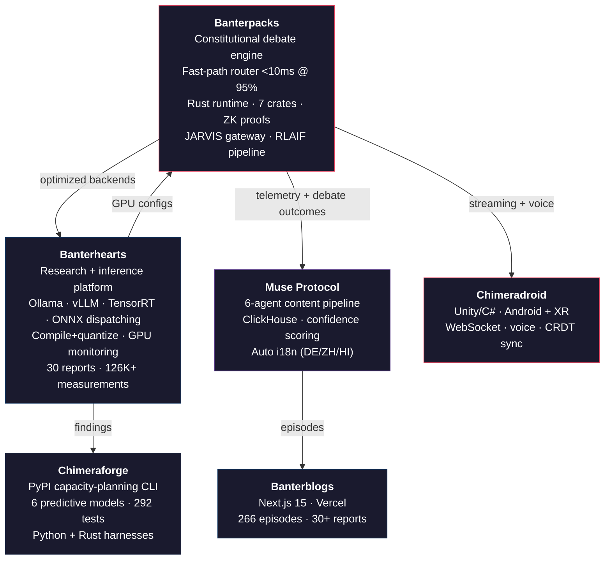

# Sahil Kadadekar

**Machine Learning Engineer | Constitutional AI | Inference Systems | Empirical Safety Research**

  

**Featured:** [Latent Space Podcast Episode](https://www.youtube.com/watch?v=6dSLZdvay3Q)

I build constitutional AI systems, optimize LLM inference down to the kernel level, and run a solo research program that has overturned 3 hypotheses so far. 30 technical reports. 126,000+ empirical measurements. Everything measured, everything reproducible.

---

## What I Build

I work across the full stack of AI systems — from CUDA kernels and Triton compilation to multi-agent runtimes, alignment architectures, and production platforms.

**Three pillars:**

1. **Inference optimization** — vLLM, TGI, Ollama, TensorRT, torch.compile, FlashAttention, quantization sweeps, Nsight Systems kernel profiling. I don't guess where the bottleneck is. I trace it.

2. **Constitutional AI** — debate engines, alignment runtimes in Rust with zero-knowledge proofs, embedding-based routers, RLAIF loops that generate their own training data. AI that governs itself.

3. **Empirical safety research** —30 technical reports measuring what actually happens to safety when you quantize, batch, swap backends, and scale concurrency. Findings backed by TOST equivalence testing, effect-size analysis, and Holm-Bonferroni correction. Three major hypotheses overturned.

---

## The Chimera Ecosystem

**6 repositories. 15+ services. 5 languages. One obsession: make AI systems that are fast, safe, and honest.**

---

## Banterpacks — Constitutional AI Runtime

**The core.** Everything else in the ecosystem feeds into or out of this.

- **Constitutional Debate Engine (TDD001):** Multi-model debate with heat-based escalation and 3 consensus algorithms. Constitutional principles as first-class constraints, not afterthoughts.
- **Fast-Path Router (TDD002):** Embedding-based cosine similarity routing. 95% of queries resolved in <10ms without touching the debate engine.
- **Rust Alignment Runtime (TDD005):** 7 crates. BFT consensus, Ed25519 provenance chains, zero-knowledge proofs via Pedersen commitments on Ristretto255, CRDT sync for cross-device state.
- **RLAIF Pipeline:** Debate outcomes generate DPO training pairs that continuously refine the router's alignment centroid. The system improves itself.
- **JARVIS Gateway:** Unified AI assistant with chat (turn-based state machine), voice (Whisper STT, TTS, wake word, barge-in), tool execution with human-in-the-loop approval, WebSocket streaming, and durable workflows.

> *The alignment layer doesn't just steer the model. It proves it steered correctly.*

---

## Banterhearts — Research & Inference Platform

**The measurement engine.** Every claim in the research program comes from code running here.

- **Capability-aware backend dispatching** — Ollama, HuggingFace Transformers, ONNX Runtime, TensorRT. The system picks the right backend for the job.
- **Compile+quantize pipeline** with latency/accuracy guardrails
- **Thompson Sampling auto-optimizer** for configuration discovery
- **GPU monitoring** —100ms power polling, thermal safety, VRAM fragmentation tracking via pynvml
- **TensorRT engine building**, ONNX model export, torch.compile with Inductor backend
- **KV-cache analysis** — theoretical + empirical measurement, CUDA graph crash reproduction

> *If you can't measure it, you can't optimize it. If you can't reproduce the measurement, you didn't measure it.*

---

## Chimeraforge — Capacity Planning CLI

**The tool that ships the research.**

Published on [PyPI](https://pypi.org/project/chimeraforge/) —`pip install chimeraforge`

- 6 predictive models (R² > 0.85 throughput, > 0.96 VRAM, <1s runtime, zero GPU required)
- Dual-language benchmarking harnesses (Python + Rust)
- 292 tests
- Operationalizes findings from 30 technical reports into deployment decisions

> *Research that stays in a PDF is a hobby. Research that ships as a CLI is engineering.*

---

## Chimeradroid — Android & XR Client

Unity/C# JARVIS client for Android and Android XR. WebSocket streaming, voice interface, tool approval UI, cross-device sync via CRDT, and session handoff. Embodiment-based architecture — runs on Android XR headsets for early-stage embodied agent work.

**Currently:** Extending cross-device reach so JARVIS on your phone talks to your local laptop GPU. No cloud dependency. Walk around, keep talking to your agents.

> *The ecosystem runs everywhere, not just on a dev machine.*

---

## Research Program

**30 technical reports (TR 108--137). 126,000+ empirical measurements. 3 hypotheses overturned.**

Decision-grade statistical validation: TOST equivalence testing, Cohen's d effect sizes, Holm-Bonferroni correction, bootstrap confidence intervals.

### AI Safety & Alignment | 74,254 samples

Quantified the **safety tax of inference optimization** across 4 model families:

| Factor | Share of Safety Cost |
|--------|---------------------|
| Quantization | **57%** |
| Backend | **41%** |
| Concurrency | **2%** (null result, TOST-confirmed) |

Key finding: **backend matters more than numerical precision for safety.** A 23pp safety drop traced to chat template divergence, not FP16 vs Q4 arithmetic.

### Inference Systems & GPU Kernel Profiling | ~35,000 measurements

Proved via **Nsight Systems** kernel tracing that the multi-agent scaling bottleneck is **GPU memory bandwidth physics**, not serving software. Continuous batching (vLLM/TGI) amortizes this:

| Metric | Improvement |
|--------|-------------|
| Kernel count reduction | **80%** |
| Memory bandwidth reduction | **79–83%** |
| Throughput at N=8 | **2.25x** |

### Scaling Laws & Capacity Planning | ~33,000 measurements

- Multi-agent scaling follows **Amdahl's Law** (R² > 0.97), throughput plateaus at N=2
- **Q4_K_M** is the universal quantization sweet spot (30–67% cost savings)
- **VRAM spillover** causes 25–105x latency cliffs — the real context-length bottleneck, not quadratic attention

### Hypotheses Overturned

1. **M/D/1 queueing theory** — deviates 20.4x from observed behavior (TR 128)
2. **NUM_PARALLEL enables concurrent GPU inference** — confirmed no-op, 0/30 tests significant (TR 128)
3. **Serving stack is the scaling bottleneck** — GPU memory bandwidth physics dominates; PyTorch Direct degrades worse than Ollama (TR 131)

---

## Recent Shipped Work

### GhostEye Inc. — Founding Engineer (AI/ML)

Built a **security awareness training platform in 90 days** as a founding engineer. Multi-channel delivery across web, Slack, Teams, SMS/RCS, WhatsApp, Telegram, voice, and email.

- Phishing email generation pipeline on **self-hosted 70B LLMs** with **domain-specific LoRA/QLoRA adapters** trained on a 1M+ email corpus
- Reduced **deepfake phishing simulation** latency from **40s to 100--450ms** (80--400x improvement)
- Input guardrails across all APIs and agents with adversarial attempt logging
- **5 specialized PR-review agents** distilled from ~2,500 comments across ~1,000 PRs
- 5000+ tests across ~10 services

### Attunica AI — Co-Founder & Chief Architect

Four-service AI platform for psychotherapy training.

- Real-time streaming agent via **LiveKit SDK** + **Google Gemini Realtime API** in sub-100ms WebRTC sessions
- Evaluation microservice with **Claude Sonnet 4.5** for criterion-based feedback
- Privacy-first system (~$1.20/session) via transcript-mirroring protocol

---

## Open Source

| Project | Description |
|:--------|:------------|
| [**chimeraforge**](https://pypi.org/project/chimeraforge/) | PyPI capacity-planning CLI. 6 predictive models, 292 tests. |
| [**PyTorch PR #175562**](https://github.com/pytorch/pytorch/pull/175562) | Triaged upstream PR — torch.compile autoregressive decode failure with growing KV-cache tensors. Traced into cudagraph_trees deallocation. |

---

## Tech Stack

**Languages:** Python, TypeScript, Rust, C#, SQL, C++, Java

**GPU & Compilation:** CUDA, Triton, TensorRT, FlashAttention, ONNX Runtime, torch.compile, Nsight Systems / Nsight Compute, quantization (GPTQ, AWQ, INT4/INT8)

**Inference & Serving:** vLLM, TGI, Ollama, llama.cpp (GGUF), continuous batching, KV-cache optimization

**Frameworks:** FastAPI, Next.js, PyTorch, Transformers, PEFT, Ray, DeepSpeed, LangGraph, LangSmith, LiveKit

**Infra:** AWS (Lambda, S3, DynamoDB, SQS, IAM), Docker, Kubernetes, Vercel, ClickHouse, Redis, PostgreSQL, MinIO

**Monitoring:** Prometheus, Grafana, Datadog, OpenTelemetry, pynvml, MLflow, W&B

---

## Visual Gallery

| Artifact | Description | Preview | Links |
|:---------|:------------|:--------|:------|
| **CI/CD Dashboard** | Datadog pipeline & tests overview |  | —|
| **Chimera Engine Profiling** | Nsight Compute profiling on RTX 4080 |  | —|
| **Frontend UI** | Application frontend snapshot |  | —|
| **Performance** | Throughput/latency view |  | —|
| **Banterpacks Demo** | Live demo still |  | [YouTube Demo](https://youtu.be/IPbwLB_sZ9I) |

---

## Other Projects

| Project | Description |
|:--------|:------------|
| **CCPhotosearchBot** | Serverless AWS bot for natural-language photo search using Rekognition + OpenSearch. |
| **LumaChat** | JavaFX desktop chat client with AI assistant, secure auth, and MongoDB persistence. |
| **DLProject** | Anomaly detection on MVTec-AD using Anomalib (PatchCore, FastFlow, STFPM) with AUROC evaluations. |
| **MaidMind** | Modular AI assistant with scoped memory and task-based agent logic. |
| **Aion / CodeMind** | Autonomous Python interpreter evolving via multi-agent LLM patch collaboration. |
| **RAG_Vidquest** | Lecture-video QA system using retrieval-augmented generation and multimodal search. |

---

## Publications

### 2023

**Digital Currency Price Prediction using Machine Learning**
*IJRASET 11(9): 338–355* — Sep 2023

### 2022

**Machine Learning Based Car Damage Identification**
*JETIR 9(10)* — Oct 2022
[-brightgreen?style=flat)](https://www.jetir.org/papers/JETIR2210195.pdf)

---

## Reach Me

  

---

> *"Measure everything. Trust nothing. Ship anyway."*

