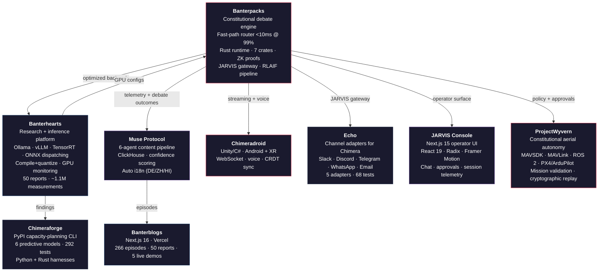

# Sahil Kadadekar

**Machine Learning Engineer | Constitutional AI | Inference Systems | Empirical Safety Research**

  

**Featured:** [Latent Space AI in Action Talk — Oct 2025](https://www.youtube.com/watch?v=6dSLZdvay3Q)
**Technical Blog:** [The Third State in AI alignment](https://substack.com/home/post/p-191551029)

I build constitutional AI systems, optimize LLM inference down to the kernel level, and run a solo research program that has overturned 3 hypotheses so far. **50 technical reports. ~1.1M decision-grade measurements** (curated from ~10⁹ profiler samples). **1 ICML 2026 workshop paper accepted + 5 under review at a top ML venue.** Everything measured, everything reproducible.

---

## What I Build

I work across the full stack of AI systems — from CUDA kernels and Triton compilation to multi-agent runtimes, alignment architectures, and production platforms.

**Three pillars:**

1. **Inference optimization** — vLLM, TGI, Ollama, TensorRT, torch.compile, FlashAttention, quantization sweeps, Nsight Systems kernel profiling. I don't guess where the bottleneck is. I trace it.

2. **Constitutional AI** — debate engines, alignment runtimes in Rust with zero-knowledge proofs, embedding-based routers, RLAIF loops that generate their own training data. AI that governs itself.

3. **Empirical safety research** — 50 technical reports measuring what actually happens to safety when you quantize, batch, swap backends, scale concurrency, or change KV-cache precision. Findings backed by TOST equivalence testing, effect-size analysis, and Holm-Bonferroni correction. Three major hypotheses overturned, and the program's first mitigation now recovers 76% of the quantization refusal gap. One paper accepted at the ICML 2026 Workshop on Hypothesis Testing; five under review at a top ML venue.

---

## The Chimera Ecosystem

**Founder & Lead ML Architect · Sep 2025 – Present · New York, USA**

**9 repositories. 15+ services. 5 languages. One obsession: make AI systems that are fast, safe, and honest.**

> **Repo visibility — private by design:** Banterpacks, Banterhearts, and Muse Protocol are the private research substrate. They hold in-flight studies, unpublished safety data, and the corpus the workshop paper and submissions referenced above were drawn from. Keeping them closed is a deliberate research-strategy choice — public release would surrender the priority window on unpublished work to anyone with more compute. Read access on request via the [Reach Me](#reach-me) links for serious inquiries (research collaborators, PhD advisors, hiring teams under NDA). Public surfaces: [Chimeraforge](https://github.com/Sahil170595/Chimeraforge), [Chimeradroid](https://github.com/Sahil170595/Chimeradroid), [Banterblogs](https://github.com/Sahil170595/Banterblogs), [Echo](https://github.com/Sahil170595/Echo), [JARVIS Console](https://github.com/Sahil170595/jarvis-console), and [ProjectWyvern](https://github.com/Sahil170595/ProjectWyvern).

---

## Banterpacks — Constitutional AI Runtime

**The core.** Everything else in the ecosystem feeds into or out of this.

- **Constitutional Debate Engine (TDD001):** Multi-model debate with heat-based escalation and 3 consensus algorithms. Constitutional principles as first-class constraints, not afterthoughts.
- **Fast-Path Router (TDD002):** Embedding-based cosine similarity routing. 99% of queries resolved in <10ms without touching the debate engine.
- **Rust Alignment Runtime (TDD005):** 7 crates. BFT consensus, Ed25519 provenance chains, zero-knowledge proofs via Pedersen commitments on Ristretto255, CRDT sync for cross-device state.
- **RLAIF Pipeline:** Debate outcomes generate DPO training pairs that continuously refine the router's alignment centroid. The system improves itself.
- **JARVIS Gateway:** Unified AI assistant with chat (turn-based state machine), voice (Whisper STT, TTS, wake word, barge-in), tool execution with human-in-the-loop approval, WebSocket streaming, and durable workflows.

> *The alignment layer doesn't just steer the model. It proves it steered correctly.*

---

## Banterhearts — Research & Inference Platform

**The measurement engine.** Every claim in the research program comes from code running here.

- **Capability-aware backend dispatching** — Ollama, HuggingFace Transformers, ONNX Runtime, TensorRT. The system picks the right backend for the job.
- **Compile+quantize pipeline** with latency/accuracy guardrails
- **Thompson Sampling auto-optimizer** for configuration discovery
- **GPU monitoring** — 100ms power polling, thermal safety, VRAM fragmentation tracking via pynvml
- **TensorRT engine building**, ONNX model export, torch.compile with Inductor backend
- **KV-cache analysis** — theoretical + empirical measurement, CUDA graph crash reproduction

> *If you can't measure it, you can't optimize it. If you can't reproduce the measurement, you didn't measure it.*

---

## Chimeraforge — Capacity Planning CLI

**The tool that ships the research.**

Published on [PyPI](https://pypi.org/project/chimeraforge/) —`pip install chimeraforge`

- 6 predictive models (R² > 0.85 throughput, > 0.96 VRAM, <1s runtime, zero GPU required)
- Dual-language benchmarking harnesses (Python + Rust)
- 292 tests
- Operationalizes findings from 50 technical reports into deployment decisions

> *Research that stays in a PDF is a hobby. Research that ships as a CLI is engineering.*

---

## Chimeradroid — Android & XR Client

Unity/C# JARVIS client for Android and Android XR. WebSocket streaming, voice interface, tool approval UI, cross-device sync via CRDT, and session handoff. Embodiment-based architecture — runs on Android XR headsets for early-stage embodied agent work.

**Currently:** Extending cross-device reach so JARVIS on your phone talks to your local laptop GPU. No cloud dependency. Walk around, keep talking to your agents.

> *The ecosystem runs everywhere, not just on a dev machine.*

---

## Echo — Channel Adapters

The messaging bridge between external platforms and the JARVIS gateway. **5 adapters** (Slack Socket Mode, Discord Gateway, Telegram long-poll, WhatsApp Cloud API webhooks, SMTP/IMAP email) and **68 tests**. Each adapter is a thin HTTP relay — no intelligence, just platform-specific formatting. All cognition lives in JARVIS.

---

## JARVIS Console — Operator UI

Next.js 15 + React 19 operator surface for JARVIS. Radix primitives, Framer Motion, Tailwind. Chat, tool-approval workflows, session telemetry, and live agent state.

---

## ProjectWyvern — Constitutional Aerial Autonomy

The autonomy plane in the Chimera ecosystem. Sits between the Chimera control plane (identity, policy, operator approvals) and the flight controller (PX4/ArduPilot via MAVSDK/MAVLink/ROS 2). Owns mission validation, command arbitration, telemetry normalization, and cryptographically replayable mission archives.

> *AI assists planning. It never bypasses deterministic safety or operator authority.*

---

## Research Program

**50 technical reports (TR 108–TR 164). ~1.1M decision-grade measurements (curated from ~10⁹ profiler samples). 3 hypotheses overturned. 1 ICML 2026 workshop paper accepted + 5 under review at a top ML venue.**

Decision-grade statistical validation: TOST equivalence testing, Cohen's d effect sizes, Holm-Bonferroni correction, bootstrap confidence intervals.

### AI Safety & Alignment | 74,254 samples

Quantified the **safety tax of inference optimization** across 4 model families:

| Factor | Share of Safety Cost |
|--------|---------------------|
| Quantization | **57%** |
| Backend | **41%** |
| Concurrency | **2%** (null result, TOST-confirmed) |

Key finding: **backend matters more than numerical precision for safety.** A 23pp safety drop traced to chat template divergence, not FP16 vs Q4 arithmetic.

**First mitigation (TR163):** After a program of pure measurement, RTSI-gated routing recovers **~76%** of the weight-quantization refusal gap by routing the riskiest **20%** of configs to direct safety testing (LOOCV ROC-AUC **0.84**, validated across LOOCV passes during the [QuantSafe Certifier](https://huggingface.co/spaces/build-small-hackathon/quantsafe-certifier) buildout; the companion [arXiv preprint](https://arxiv.org/abs/2606.10154) reports the same intervention under a recall framing — 10/10 hidden-danger configs routed, Wilson 95% CI lower-bound 0.72) — the move from measuring the problem to defending against it.

### Inference Systems & GPU Kernel Profiling | ~35,000 measurements

Proved via **Nsight Systems** kernel tracing that the multi-agent scaling bottleneck is **GPU memory bandwidth physics**, not serving software. Continuous batching (vLLM/TGI) amortizes this:

| Metric | Improvement |
|--------|-------------|
| Kernel count reduction | **80%** |
| Memory bandwidth reduction | **79–83%** |
| Throughput at N=8 | **2.25x** |

### Scaling Laws & Capacity Planning | ~33,000 measurements

- Multi-agent scaling follows **Amdahl's Law** (R² > 0.97), throughput plateaus at N=2
- **Q4_K_M** is the universal quantization sweet spot (30–67% cost savings)
- **VRAM spillover** causes 25–105x latency cliffs — the real context-length bottleneck, not quadratic attention

### Hypotheses Overturned

1. **M/D/1 queueing theory** — deviates 20.4x from observed behavior (TR 128)
2. **NUM_PARALLEL enables concurrent GPU inference** — confirmed no-op, 0/30 tests significant (TR 128)
3. **Serving stack is the scaling bottleneck** — GPU memory bandwidth physics dominates; PyTorch Direct degrades worse than Ollama (TR 131)

---

## Recent Shipped Work

### GhostEye Inc. — Founding Engineer (AI/ML)
*Dec 2025 – Mar 2026 · New York, USA*

Built a **security awareness training platform in 90 days** as a founding engineer. Multi-channel delivery across web, Slack, Teams, SMS/RCS, WhatsApp, Telegram, voice, and email.

- Phishing email generation pipeline on **self-hosted 70B LLMs** with **domain-specific LoRA/QLoRA adapters** trained on a 1M+ email corpus
- Reduced **deepfake phishing simulation** latency from **40s to 100--450ms** (80--400x improvement)
- Input guardrails across all APIs and agents with adversarial attempt logging
- **5 specialized PR-review agents** distilled from ~2,500 comments across ~1,000 PRs
- 5000+ tests across ~20 services

### Attunica, LLC — Co-Founder & Lead ML Architect
*Oct 2025 – Present · New York, USA*

Multi-service clinical AI platform for psychotherapy training and research workflows.

- Real-time streaming agent via **LiveKit SDK** + **Google Gemini Realtime API** for low-latency WebRTC voice/avatar sessions
- Versioned persona engine, instructor workflows, and **Claude-powered** clinical evaluation service
- Tiered consent, pattern-based PII scrubbing, research exports, and **HIPAA BAAs executed** across Anthropic and AWS

---

## Open Source

| Project | Description |
|:--------|:------------|
| [**chimeraforge**](https://pypi.org/project/chimeraforge/) | PyPI capacity-planning CLI. 6 predictive models, 292 tests. |
| [**HuggingFace model releases**](https://huggingface.co/Crusadersk) | 16 published models — 11 quantized AWQ/GPTQ checkpoints (Llama 3.2, Qwen 2.5), 4 custom GPT-2 scaling-law training runs, and [**quantsafe-refusal-modernbert**](https://huggingface.co/Crusadersk/quantsafe-refusal-modernbert) (ModernBERT-base binary refusal classifier, **97.73% accuracy / 0.9773 F1** on XSTest, beats lexicon baseline by ~45pp). |
| [**QuantSafe Certifier**](https://huggingface.co/spaces/build-small-hackathon/quantsafe-certifier) | Live HF Space operationalizing the RTSI research arc end-to-end: 4-delta refusal screen (entropy / prefix variation / length), ModernBERT semantic cross-check, multi-judge safety stack (Qwen3Guard + Granite Guardian), constitutional debate (Qwen3-8B + Phi-4-mini + SmolLM3-3B) for contested cases, **Ed25519-signed certificates** verified against a pinned issuer key. **ROC AUC 0.8445 (LOOCV)**; HIGH-risk routing recovers **76.17%** of refusal-rate gaps affecting only **20%** of configs. Build Small Hackathon submission (≤32B catalog ceiling). |
| [**PyTorch PR #175562**](https://github.com/pytorch/pytorch/pull/175562) | **Merged into PyTorch Inductor** ([squash `be90a14`](https://github.com/pytorch/pytorch/commit/be90a14953105767e3029b49cf58fec97105a2cf), 2026-06-04) — hardened cudagraph_trees deallocation against diagnostic-metadata divergence; approved by jansel (Inductor maintainer). |
| [**PyTorch PR #184102 (validation)**](https://github.com/pytorch/pytorch/pull/184102) | Multi-version, cross-scenario validation of jansel's `cudagraph_trees` handoff fix (NGC torch 2.10 + 2.12 nightly; single/multi-partition + cross-call + strided feedback); surfaced an uncovered later-partition `graph_partition` edge case. [Validation gist](https://gist.github.com/Sahil170595/062d40cb18e2b2e27e99c1efbfa3ccdb). |

---

## Tech Stack

**Languages:** Python, TypeScript, Rust, C#, SQL, C++, Java

**GPU & Compilation:** CUDA, Triton, TensorRT, FlashAttention, ONNX Runtime, torch.compile, Nsight Systems / Nsight Compute, quantization (GPTQ, AWQ, INT4/INT8)

**Inference & Serving:** vLLM, TGI, Ollama, llama.cpp (GGUF), continuous batching, KV-cache optimization

**Frameworks:** FastAPI, Next.js, PyTorch, Transformers, PEFT, Ray, DeepSpeed, LangGraph, LangSmith, LiveKit

**Infra:** AWS (Lambda, S3, DynamoDB, SQS, IAM), Docker, Kubernetes, Vercel, ClickHouse, Redis, PostgreSQL, MinIO

**Monitoring:** Prometheus, Grafana, Datadog, OpenTelemetry, pynvml, MLflow, W&B

---

## Visual Gallery

| Artifact | Description | Preview | Links |
|:---------|:------------|:--------|:------|
| **CI/CD Dashboard** | Datadog pipeline & tests overview |  | —|
| **Chimera Engine Profiling** | Nsight Compute profiling on RTX 4080 |  | —|
| **Frontend UI** | Application frontend snapshot |  | —|
| **Performance** | Throughput/latency view |  | —|
| **Banterpacks Demo** | Live demo still |  | [YouTube Demo](https://youtu.be/IPbwLB_sZ9I) |

---

## Publications

### 2026

**A Paired Testing Protocol for Batch-Conditioned Refusal Robustness in LLM Serving**
*Accepted — ICML 2026 Workshop on Hypothesis Testing*

**Quality Is Not a Safety Proxy Under Quantization**
*Preprint — cs.LG, cs.CR*

---

## Earlier Research (2022–2023)

**Medical AI Imaging — Multi-Phase Clinical Pipeline**
Led a 4-person engineering + clinical team (3 engineers, 1 physician) across a 5-institution program (state government, city university, dental hospital, 2 engineering colleges) building TensorFlow/Keras pipelines over clinical imaging — dental (POC) → retinal (Phase 2) → EEG (Phase 4+). Stack: LSTM + attention multi-classification, W&B experiment tracking, SHAP interpretability, pinned-memory CPU↔GPU transfer optimization.

Registered work: **Copyright L-122721/2023**.

---

## Reach Me

  

---

> *"Measure everything. Trust nothing. Ship anyway."*

