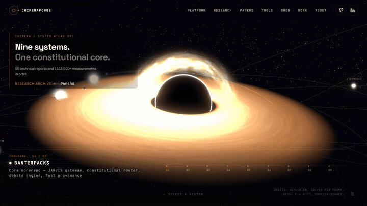
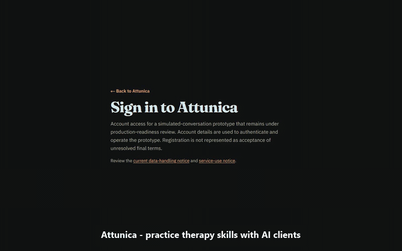

# Sahil Kadadekar

**Machine Learning Engineer | Constitutional AI | Inference Systems | Empirical Safety Research**

  

**Featured:** [Latent Space AI in Action Talk, Oct 2025](https://www.youtube.com/watch?v=6dSLZdvay3Q)
**Technical Blog:** [The Third State in AI alignment](https://substack.com/home/post/p-191551029)

I build and harden AI systems where failure is expensive. I'm Co-Founder and Head of Engineering at **Attunica** (clinical AI for psychotherapy training, first-customer release live on AWS) and was the first hire at **GhostEye** (YC S25). On my own I run **Chimera**, a public inference-safety research program: **55 [technical reports](https://github.com/Sahil170595/Sahil170595/tree/main/reports) / 1.46M+ measurements**, **1 ICML 2026 workshop paper accepted + 8 under peer review**, fixes landed in **vLLM, PyTorch, Ollama, and Triton**, and two PyPI tools with **37K+ downloads**.

---

## What I Build

Full-stack: CUDA kernels and Triton compilation up through multi-agent runtimes, alignment architectures, and production platforms. Three pillars:

1. **Inference optimization:** vLLM, TGI, Ollama, TensorRT, torch.compile, FlashAttention, quantization sweeps, Nsight Systems kernel profiling. I don't guess where the bottleneck is. I trace it.

2. **Constitutional AI:** debate engines, alignment runtimes in Rust with zero-knowledge proofs, embedding-based routers, RLAIF loops that generate their own training data. AI that governs itself.

3. **Empirical safety research:** what actually happens to safety when you quantize, batch, swap backends, scale concurrency, or change KV-cache precision, tested with TOST equivalence, effect sizes, and Holm-Bonferroni correction. RTSI-gated routing recovers 76% of the quantization refusal gap.

---

## ICML 2026 Agent Reproducibility Challenge (sister repo)

**[icml2026-paper-reproductions](https://github.com/Sahil170595/icml2026-paper-reproductions)** · Final: **rank #26 of 1,221 participants (top 2.1%)** · **48 papers** · 249 official claims judged: **118 verified, 3 published claims falsified** · 297 pts · verdicts frozen 2026-08-02.

Independent, from-scratch reproductions of ICML 2026 submissions, produced by an agentic pipeline and judged claim by claim by the challenge's independent referee. Acceptance and falsification rules are pre-registered before each run; producers cannot publish their own bundles, and reviewers cannot repair what they judge. Every reproduction ships its per-paper evidence: [methodology](https://github.com/Sahil170595/icml2026-paper-reproductions/blob/main/METHODOLOGY.md) · [frozen leaderboard](https://icml-2026-agent-repro-challenge.static.hf.space/leaderboard.html).

---

## Chimera

**Founder & Lead ML Architect · Sep 2025 – Present · New York, USA**

**Adaptive constitutional engine. Rust alignment runtime. One obsession: make AI systems that are fast, safe, and honest.**

  

| Component | What it does |
|:----------|:-------------|
| **Banterpacks** (core) | Multi-model constitutional debate with heat-based escalation and 3 consensus algorithms; an embedding fast-path router that resolves 99% of queries in under 10ms; a 7-crate Rust alignment runtime (BFT consensus, Ed25519 provenance, Pedersen-commitment ZK proofs on Ristretto255, CRDT sync); an RLAIF loop that turns debate outcomes into DPO pairs. |
| **JARVIS Gateway** | Chat, voice (Whisper STT, TTS), PostgreSQL/pgvector graph memory, human-in-the-loop tool approval, WebSocket streaming, and durable workflows. |
| **Banterhearts** (research substrate) | The measurement and paper engine: multi-backend evaluation and serving harnesses (Transformers, Ollama, ONNX, vLLM, SGLang, TGI), per-sample JSONL provenance, pre-registered runs held to frozen gates, disagreement-aware judge triangulation, fail-closed analyzers, and frozen-byte paper packages with anonymous reviewer artifacts. |
| [**Chimeraforge**](https://github.com/Sahil170595/Chimeraforge) | Capacity-planning CLI and MCP server that ships the research as deployment decisions (below). |
| [**Chimeradroid**](https://github.com/Sahil170595/Chimeradroid) | Unity/C# JARVIS client for Android and Android XR that talks straight to a local laptop GPU, no cloud. |
| [**Echo**](https://github.com/Sahil170595/Echo) | 5 channel adapters (Slack, Discord, Telegram, WhatsApp, email) as thin relays into JARVIS. |
| [**JARVIS Console**](https://github.com/Sahil170595/jarvis-console) | Next.js 15 + React 19 operator UI: chat, tool approvals, session telemetry, live agent state. |
| [**ProjectWyvern**](https://github.com/Sahil170595/ProjectWyvern) | Constitutional aerial autonomy between Chimera policy and PX4/ArduPilot: mission validation, command arbitration, replayable mission archives. AI assists planning; it never bypasses deterministic safety. |
| [**Banterblogs**](https://github.com/Sahil170595/Banterblogs) | Write-ups from the research program. |

Banterpacks, Banterhearts, and Muse Protocol are private during the publication window; read access on request via [Reach Me](#reach-me).

---

## Chimeraforge: Capacity Planning CLI

**The tool that ships the research.** `pip install chimeraforge` · [PyPI](https://pypi.org/project/chimeraforge/) · [changelog](https://github.com/Sahil170595/Chimeraforge/blob/main/CHANGELOG.md)

- Plans model × quantization × backend × GPU/TP/PP deployments, including heterogeneous fleets, against VRAM, TTFT/TPOT, throughput, KV-cache and CPU offload, prefix caching, multi-LoRA, cost, and energy; emits vLLM, TGI, SGLang, and Ollama launch commands
- Every number carries a provenance label (measured, extrapolated, derived, estimated, or unknown), and `validate` audits predictions against measurements
- 13-command CLI, Python API, and MCP server on the official MCP Registry; v0.30.10, 1,571 tests, 24K+ downloads

> *Research that stays in a PDF is a hobby. Research that ships as a CLI is engineering.*

---

## Research Program

**55 [technical reports](https://github.com/Sahil170595/Sahil170595/tree/main/reports) (TR 108–167). 1.46M+ decision-grade measurements (curated from ~10⁹ profiler samples). 3 hypotheses overturned.**

**Audit path:** every TR is a markdown file in [`/reports/`](https://github.com/Sahil170595/Sahil170595/tree/main/reports). Count, read, diff. No site, no slides, no PDF wall. The folder is the source of truth.

Decision-grade statistical validation: TOST equivalence testing, Cohen's d effect sizes, Holm-Bonferroni correction, bootstrap confidence intervals.

### AI Safety & Alignment | 74,254 samples

Quantified the **safety tax of inference optimization** across 4 model families:

| Factor | Share of Safety Cost |
|--------|---------------------|
| Quantization | **57%** |
| Backend | **41%** |
| Concurrency | **2%** (null result, TOST-confirmed) |

Key finding: **backend matters more than numerical precision for safety.** A 23pp safety drop traced to chat template divergence, not FP16 vs Q4 arithmetic.

**First mitigation (TR163):** RTSI-gated routing recovers **~76%** of the weight-quantization refusal gap by routing the riskiest **20%** of configs to direct safety testing. LOOCV ROC-AUC **0.84**, validated across LOOCV passes during the [QuantSafe Certifier](https://huggingface.co/spaces/build-small-hackathon/quantsafe-certifier) buildout; the companion [arXiv preprint](https://arxiv.org/abs/2606.10154) routes 10/10 hidden-danger configs, Wilson 95% CI lower bound 0.72.

### Inference Systems & GPU Kernel Profiling | ~35,000 measurements

Proved via **Nsight Systems** kernel tracing that the multi-agent scaling bottleneck is **GPU memory bandwidth physics**, not serving software. Continuous batching (vLLM/TGI) amortizes this:

| Metric | Improvement |
|--------|-------------|
| Kernel count reduction | **80%** |
| Memory bandwidth reduction | **79–83%** |
| Throughput at N=8 | **2.25x** |

  

*Nsight Compute trace from the kernel-profiling pass that produced the measurements above.*

### Scaling Laws & Capacity Planning | ~33,000 measurements

- Multi-agent scaling follows **Amdahl's Law** (R² > 0.97), throughput plateaus at N=2
- **Q4_K_M** is the universal quantization sweet spot (30–67% cost savings)
- **VRAM spillover** causes 25–105x latency cliffs, the real context-length bottleneck, not quadratic attention

### Hypotheses Overturned

1. **M/D/1 queueing theory:** deviates 20.4x from observed behavior (TR 128)
2. **NUM_PARALLEL enables concurrent GPU inference:** confirmed no-op, 0/30 tests significant (TR 128)
3. **Serving stack is the scaling bottleneck:** GPU memory bandwidth physics dominates; PyTorch Direct degrades worse than Ollama (TR 131)

---

## Recent Shipped Work

### Attunica, LLC · Co-Founder & Head of Engineering
*Oct 2025 – Present · New York, USA*

Clinical AI platform for psychotherapy training: social-work students run sessions with voice-and-avatar AI clients, and instructors assess them. NYU Silver MSW pilot; HIPAA BAAs executed across Anthropic and AWS. I architected and solo-built the platform core and lead a PM and two engineers.

  

*Walkthrough recorded on a local stack with synthetic practice data.*

- **First-customer release live on AWS** (Sep 2026): backend, frontend, LiveKit agent, and evaluation services on ECS, with Aurora PostgreSQL 18 and Bedrock; the deployed evaluator was accepted only after an audited Bedrock canary
- Real-time sessions on **LiveKit + Gemini Live + Anam** avatars, with Deepgram producing the canonical transcript and recorded sessions under revocable consent
- **Five-criterion formative evaluation** that separates "no evidence" from "scored zero", plus an **instructor human-assessment lifecycle** (immutable submit, receipted release) with the rubric blocked from automation
- **Consent-gated research layer:** optional, granular, versioned consent with immutable decision evidence and revocation; collection stays off until activated
- Instructor authoring with PDF/DOCX source ingestion: hash-bound uploads, macro and external-link rejection, source text treated as untrusted input
- Every change passes an exact-base validator with append-only admission, so a PR cannot weaken the checks that approve it
- **Article 31 documentation product** for clinicians (v0.5.1 on ECS): release-gated deploys, on-device Whisper dictation, browser-only PDF extraction, psychotherapy-note authorship enforced end to end

### GhostEye Inc. (YC S25) · Founding Engineer (AI/ML), first hire
*Dec 2025 – Mar 2026 · New York, USA*

Built a **security awareness training platform in 90 days** as a founding engineer. Multi-channel delivery across web, Slack, Teams, SMS/RCS, WhatsApp, Telegram, voice, and email.

- Phishing email generation pipeline on **self-hosted 70B LLMs** with **domain-specific LoRA/QLoRA adapters** trained with **DeepSpeed** on a 1M+ email corpus
- Reduced **deepfake phishing simulation** latency from **40s to 100–450ms** (80–400x improvement) via a multi-agent WebRTC pipeline (video render agent + voice agent); range reflects per-call workload depth
- Input guardrails across all APIs and agents with adversarial attempt logging
- **5 specialized PR-review agents** distilled from ~2,500 comments across ~1,000 PRs

---

## Open Source

| Project | Description |
|:--------|:------------|
| [**chimeraforge**](https://pypi.org/project/chimeraforge/) | Capacity-planning CLI and MCP server (details above). v0.30.10, 1,571 tests, 24K+ downloads. |
| [**quantfit**](https://pypi.org/project/quantfit/) | *"Quantize an LLM and check it still refuses what it should."* AWQ, GPTQ, SmoothQuant, FP8, RTN, and GGUF under one frozen calibration spec, with a GPU-aware preflight that refuses before a 30GB download. **QSR spec v0** release gate: Wilson-bounded verdicts that print their resolution floor instead of a bare zero, with JUnit output for CI. v0.12.16, Apache-2.0, 1,369 tests, 12K+ downloads. |
| [**HuggingFace model releases**](https://huggingface.co/Crusadersk) | 23 models: 11 AWQ/GPTQ 4-bit checkpoints, **6 FP8-Dynamic releases** (tagged TR171), 4 GPT-2 scaling-law runs, a [pre-registered Dr.GRPO LoRA on MedMCQA](https://huggingface.co/Crusadersk/qwen2.5-1.5b-medmcqa-drgrpo-lora), and [**quantsafe-refusal-modernbert**](https://huggingface.co/Crusadersk/quantsafe-refusal-modernbert) (**97.73%** accuracy on XSTest, ~45pp above a lexicon baseline). |
| [**QuantSafe Certifier**](https://huggingface.co/spaces/build-small-hackathon/quantsafe-certifier) | HF Space that turns the RTSI research into a certificate: refusal screen, ModernBERT cross-check, Qwen3Guard + Granite Guardian judges, constitutional debate for contested cases, and **Ed25519-signed certificates**. LOOCV ROC AUC **0.8445**; routing the riskiest **20%** of configs recovers **76.17%** of refusal-rate gaps. |
| [**vLLM PR #45207**](https://github.com/vllm-project/vllm/pull/45207) | **Merged** ([`55da232`](https://github.com/vllm-project/vllm/commit/55da232db6963613d34229dfd257236e6f3c8097), approved by benchislett): fixed a KV-cache page-size unification crash on **hybrid Mamba/attention models** by padding the Mamba page via `page_size_padded`. Regression test added. Fixes [#43626](https://github.com/vllm-project/vllm/issues/43626). |
| [**PyTorch PR #175562**](https://github.com/pytorch/pytorch/pull/175562) | **Landed** in PyTorch Inductor ([`be90a14`](https://github.com/pytorch/pytorch/commit/be90a14953105767e3029b49cf58fec97105a2cf), approved by jansel): hardened cudagraph_trees deallocation against diagnostic-metadata divergence. Also validated jansel's follow-up fix [#184102](https://github.com/pytorch/pytorch/pull/184102) across torch 2.10 and 2.12 nightly ([gist](https://gist.github.com/Sahil170595/062d40cb18e2b2e27e99c1efbfa3ccdb)). |
| [**Ollama PR #16669**](https://github.com/ollama/ollama/pull/16669) | **Merged** (approved by dhiltgen): root-caused two Vulkan enumeration bugs that inverted iGPU/dGPU classification on Windows hybrid graphics; **~9× faster inference** (3.8s to 0.8s), confirmed on a second machine. Fixes [#16667](https://github.com/ollama/ollama/issues/16667). |
| [**Triton PR #10819**](https://github.com/triton-lang/triton/pull/10819) | **Merged** (`b92dc43`, approved by peterbell10): fixed a `tl.flip` compile-time crash on the documented default `dim=None`, with test coverage. Fixes [#10790](https://github.com/triton-lang/triton/issues/10790). |

---

## Tech Stack

**Languages:** Python, TypeScript, Rust, C#, SQL, C++

**ML/AI:** PyTorch, TensorFlow/Keras, Transformers, DeepSpeed, Accelerate, Ray, RAG, LangGraph, LangSmith, MCP

**Web Frameworks:** FastAPI, Next.js, React

**Inference & Serving:** vLLM, SGLang, TGI, TensorRT-LLM, llama.cpp (GGUF), continuous batching, KV-cache optimization, speculative decoding

**GPU & Compilation:** CUDA, Triton, TensorRT, FlashAttention, ONNX Runtime, torch.compile, Nsight Systems / Nsight Compute, quantization (GPTQ, AWQ, INT4/INT8)

**Post-Training:** LoRA/QLoRA, RLHF, RLAIF, DPO/ORPO/KTO, GRPO-family RL, policy optimization, PRM/ORM routing, WARM judges

**Data & Analysis:** PostgreSQL, DynamoDB, Redis, ClickHouse, Qdrant, SciPy, SHAP

**Cloud & Deployment:** AWS (ECS, Bedrock, Aurora), Azure, Docker, Kubernetes, Vercel

**Monitoring:** Prometheus, Grafana, Datadog, OpenTelemetry, pynvml, MLflow, W&B

---

## Publications

### 2026

**A Paired Testing Protocol for Batch-Conditioned Refusal Robustness in LLM Serving**
*Accepted, ICML 2026 Workshop on Hypothesis Testing*

**Quality Is Not a Safety Proxy Under Quantization: The Refusal Template Stability Index**
*Preprint*

**Speculative Decoding at Temperature Zero: A Scoped Safety-Invariance Screen with a 48,072-Sample Expansion**
*Preprint*

*8 more under double-blind review; titles withheld until decisions.*

---

## Earlier Research (2022–2023)

**Medical AI Imaging: Multi-Phase Clinical Pipeline**
Led a 4-person engineering + clinical team (3 engineers, 1 physician) across a 5-institution program (state government, city university, dental hospital, 2 engineering colleges) building TensorFlow/Keras pipelines over clinical imaging: dental (POC) → retinal (Phase 2) → EEG (Phase 4+). Stack: LSTM + attention multi-classification, W&B experiment tracking, SHAP interpretability, pinned-memory CPU↔GPU transfer optimization.

Registered work: **Copyright L-122721/2023**.

---

## Reach Me

  

---

> *"The first principle is that you must not fool yourself, and you are the easiest person to fool."*
>
> Richard Feynman

