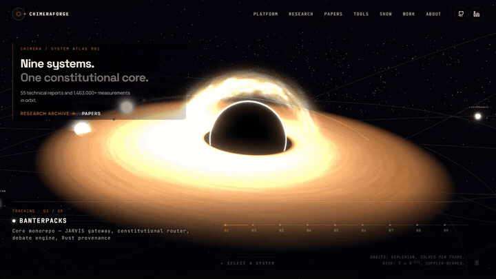
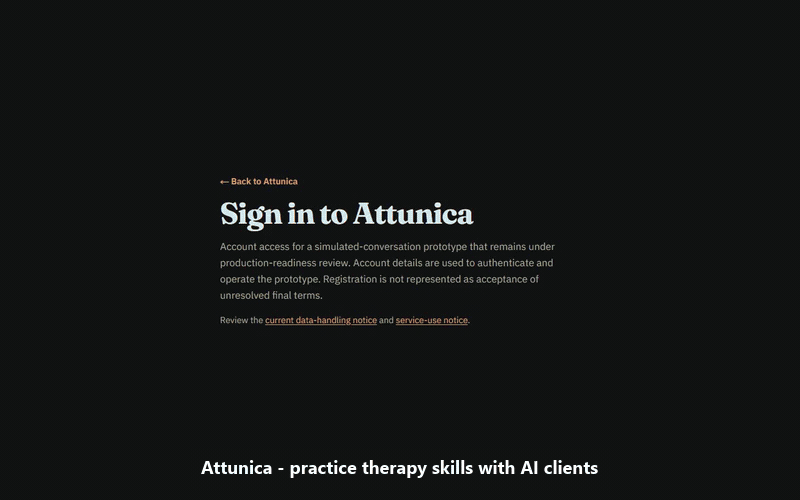

# Sahil Kadadekar

**Machine Learning Engineer | LLM Inference | Post-Training & RL Environments | Evals & Safety Research**

   

**Featured:** [Latent Space AI in Action Talk, Oct 2025](https://www.youtube.com/watch?v=6dSLZdvay3Q)
**Technical Blog:** [The Third State in AI alignment](https://substack.com/home/post/p-191551029)

I build and harden AI systems where failure is expensive. I'm Co-Founder and Head of Engineering at **Attunica** (clinical AI for psychotherapy training, live on AWS in 2 pilots) and was the first hire at **GhostEye** (YC S25). On my own I run **Chimera**, a public inference-safety research program: **55 technical reports / 1.46M+ measurements** ([47 public](https://github.com/Sahil170595/Sahil170595/tree/main/reports)), **2 workshop papers accepted (ICML 2026, NeurIPS 2026) + 1 under peer review**, six merged fixes in **vLLM, PyTorch, Ollama, and Triton**, two PyPI tools with **53K+ downloads**, and **4 public RL environments** with interactive demos.

---

## Portfolio: Systems Running Live

**[chimeraforge.vercel.app/projects](https://chimeraforge.vercel.app/projects)** · 11 systems I built, each rebuilt in the browser on synthetic data so you can run it yourself. Source repos are public.

| RL environment | What it is | What the demo shows |
|:---------------|:-----------|:--------------------|
| [**Turncraft**](https://github.com/Sahil170595/turncraft-env) · [demo](https://chimeraforge.vercel.app/projects/reinforcement-learning/customer-service) | Customer-service agent environment: 9 identity-bound tools that change order records, rewarded for what the records end up saying, not what the agent said | 34 scripted controls gate 8 cases: successful runs score **0.978–1.000**, do-nothing **≤ 0.177**, forbidden **≤ −0.380**. Refunding the duplicate charge scores 1.00; refunding the real one scores −0.40 |
| [**Patchglass**](https://github.com/Sahil170595/patchglass) · [demo](https://chimeraforge.vercel.app/projects/reinforcement-learning/code-verification) | Containerized code-repair environment: reward comes from running every test on the buggy and the patched code, with hidden tests restored | Four candidate fixes: a two-test smoke suite passes **three**, the full six-test suite passes **one** |
| [**Gatebound**](https://github.com/Sahil170595/gatebound-rl) · [demo](https://chimeraforge.vercel.app/projects/reinforcement-learning/flight-routing) | Gymnasium flight-routing environment with masked REINFORCE and deadline-aware planning under delays and cancellations | Tight deadline: planning ahead gets **40 of 64** simulated trips to JFK on time where booking the earliest nonstop gets **0**, but 8 fewer arrive at all |
| [**Counterledger**](https://github.com/Sahil170595/counterledger-ope) · [demo](https://chimeraforge.vercel.app/projects/reinforcement-learning/offline-policy-evaluation) | Offline policy evaluation: fitted Q, sequential doubly robust, paired bootstrap, support gates | A new policy looks **0.27** better on logged decisions; a control that ignores the situation gets **65%** of that, and a changed reward erases it |

**Also live:**
- **Agents & evaluation:** [spreadsheet reasoning inspector](https://chimeraforge.vercel.app/projects/agents-and-evaluation/spreadsheet-reasoning) · [browser-agent completion gate](https://chimeraforge.vercel.app/projects/agents-and-evaluation/browser-agent-completion) · [intake triage scorer](https://chimeraforge.vercel.app/projects/agents-and-evaluation/intake-triage)
- **Systems:** [staged document search](https://chimeraforge.vercel.app/projects/systems/staged-search) · [send pacing scheduler](https://chimeraforge.vercel.app/projects/systems/send-pacing) · [drone mission governance](https://chimeraforge.vercel.app/projects/systems/mission-governance)
- **Product:** [collaborative whiteboard](https://chimeraforge.vercel.app/projects/product/collaborative-whiteboard)

---

## ICML 2026 Agent Reproducibility Challenge (sister repo)

**[icml2026-paper-reproductions](https://github.com/Sahil170595/icml2026-paper-reproductions)** · Final: **rank #26 of 1,221 participants (top 2.1%)** · **48 papers** · 249 official claims judged: **118 verified, 3 published claims falsified** · 297 pts · verdicts frozen 2026-08-02.

Independent, from-scratch reproductions of ICML 2026 submissions, produced by an agentic pipeline and judged claim by claim by the challenge's independent referee. Acceptance and falsification rules are pre-registered before each run; producers cannot publish their own bundles, and reviewers cannot repair what they judge. Every reproduction ships its per-paper evidence: [methodology](https://github.com/Sahil170595/icml2026-paper-reproductions/blob/main/METHODOLOGY.md) · [frozen leaderboard](https://icml-2026-agent-repro-challenge.static.hf.space/leaderboard.html).

---

## Chimera

**Founder & Lead ML Architect · Sep 2025 – Present · New York, USA**

  

| Component | What it does |
|:----------|:-------------|
| **Banterpacks** (core) | Multi-model constitutional debate with heat-based escalation and 3 consensus algorithms; a calibrated fast-path router with debate fallback, canaries, and rollback (its original one-class safe-centroid design failed across 3 corpora and 4 encoders, AUC 0.358–0.545, traced to topic confounding, and was replaced by a supervised safe-minus-unsafe direction); a 7-crate Rust alignment runtime (BFT consensus, Ed25519 provenance, Pedersen-commitment ZK proofs on Ristretto255, CRDT sync); an RLAIF loop that turns debate outcomes into DPO pairs. |
| **Banterhearts** (research substrate) | The measurement and paper engine: multi-backend evaluation and serving harnesses (Transformers, Ollama, ONNX, vLLM, SGLang, TGI), per-sample JSONL provenance, pre-registered runs held to frozen gates, disagreement-aware judge triangulation, fail-closed analyzers, and frozen-byte paper packages with anonymous reviewer artifacts. |
| **JARVIS** ([Console](https://github.com/Sahil170595/jarvis-console)) | Gateway with chat, voice (Whisper STT, TTS), PostgreSQL/pgvector graph memory, human-in-the-loop tool approval, WebSocket streaming, and durable workflows; Next.js 15 + React 19 operator console with live agent state. |
| [**Chimeraforge**](https://github.com/Sahil170595/Chimeraforge) | Capacity-planning CLI and MCP server that ships the research as deployment decisions ([Open Source](#open-source)). |

Also: [Chimeradroid](https://github.com/Sahil170595/Chimeradroid) (Unity/C# JARVIS client for Android and Android XR), [Echo](https://github.com/Sahil170595/Echo) (Slack, Discord, Telegram, WhatsApp, and email relays), [ProjectWyvern](https://github.com/Sahil170595/ProjectWyvern) (constitutional drone-autonomy layer over PX4/ArduPilot, in simulation), and [Banterblogs](https://github.com/Sahil170595/Banterblogs) (write-ups).

Banterpacks, Banterhearts, and Muse Protocol are private during the publication window; read access on request via [LinkedIn](https://www.linkedin.com/in/sahilkadadekar).

---

## Research Program

**55 technical reports (47 public: TR 108–149, 152, 163–165, 167) · 1.46M+ decision-grade measurements, curated from ~10⁹ profiler samples · 3 of my own pre-registered hypotheses overturned.** Every public TR is a markdown file in [`/reports/`](https://github.com/Sahil170595/Sahil170595/tree/main/reports): count, read, diff. Pre-registered paired designs, bootstrap CIs, TOST equivalence, Cohen's d, Holm-Bonferroni.

- **Safety tax of inference optimization:** normalized over two common anchor models, quantization accounts for **57%** of the safety-score cost, backend **41%**, concurrency **2%** (TOST null). Across 18 models / 10+ families, alignment type showed no detectable association (p=0.942); output instability predicted fragility best (r=0.91), and chat-template divergence sometimes exceeded precision effects.
- **Quantization safety ([RTSI preprint](https://arxiv.org/abs/2606.10154)):** safety can degrade **13.9× faster** than quality under quantization. Offline routing across 45 configurations recovered **76%** of the refusal gap with **20%** routed to direct safety testing (leave-one-cell-out AUC **0.84**); the preprint routes 10/10 hidden-danger configs (Wilson 95% lower bound 0.72). Shipped as the [QuantSafe Certifier](https://huggingface.co/spaces/build-small-hackathon/quantsafe-certifier).
- **Post-training:** objectives matched to evidence shape (paired debate preferences → DPO/ORPO, unpaired verdicts → KTO, verifiable rewards → Dr.GRPO/RLOO/REINFORCE++) behind shared eval and promotion gates. A [pre-registered Dr.GRPO RLVR run](https://huggingface.co/Crusadersk/qwen2.5-1.5b-medmcqa-drgrpo-lora) (Qwen2.5-1.5B, MedMCQA) traced a null to **76%** zero-reward-variance rollout groups; changing only the prompt gained **+8.8pp** held-out pass@1 (p=0.0003), with late rollout collapse reported alongside.
- **Overturned:** M/D/1 queueing missed continuous-batching latency by **20.4×**; `NUM_PARALLEL` had no detectable effect (0/30 significant); PyTorch Direct throughput degraded more than Ollama. A four-stack study isolated PyTorch Direct's N=2 dispatch breakdown, removed by TGI on the same GPU; a separate vLLM benchmark reached **2.25×** Ollama's throughput at N=8.

---

## Recent Shipped Work

### [Attunica](https://attunica.ai), LLC · Co-Founder & Head of Engineering
*Oct 2025 – Present · New York, USA*

Clinical AI platform for psychotherapy training: social-work students run sessions with voice-and-avatar AI clients, and instructors assess them. Live in 2 pilots: the NYU Silver MSW program and a 120-therapist clinic; HIPAA BAAs executed across Anthropic and AWS. I architected and solo-built the platform core and lead a PM and two engineers.

  

*Walkthrough recorded on a local stack with synthetic practice data.*

- **First-customer release live on AWS** (Sep 2026): backend, frontend, LiveKit agent, and evaluation services on ECS, with Aurora PostgreSQL 18 and Bedrock; the deployed evaluator was accepted only after an audited Bedrock canary
- Real-time sessions on **LiveKit + Gemini Live + Anam** avatars, with Deepgram producing the canonical transcript and recorded sessions under revocable consent
- **Five-criterion formative evaluation** that separates "no evidence" from "scored zero", plus an **instructor human-assessment lifecycle** (immutable submit, receipted release) with the rubric blocked from automation
- **Judge-validity benchmark** (40 fixtures, held-out scenarios, bias probes) for three-sample median judging: debiasing moved leniency from **+0.81** to within **0.13** anchors of zero (held-out weighted kappa **0.66** vs **0.05** null; model-written key), and showed that sample disagreement alone misses large errors
- Instructor authoring with PDF/DOCX source ingestion: hash-bound uploads, macro and external-link rejection, source text treated as untrusted input
- Every change passes an exact-base validator with append-only admission, so a PR cannot weaken the checks that approve it
- **Article 31 documentation product** for clinicians (v0.5.1 on ECS): release-gated deploys, on-device Whisper dictation, browser-only PDF extraction, psychotherapy-note authorship enforced end to end

### GhostEye Inc. (YC S25) · Founding Engineer (AI/ML), first hire
*Dec 2025 – Mar 2026 · New York, USA*

Built a **security awareness training platform in 90 days** as a founding engineer. Multi-channel delivery across web, Slack, Teams, SMS/RCS, WhatsApp, Telegram, voice, and email.

- Shipped to **5 enterprise pilots**; barge-in, streaming, caching, and summarization cut per-turn latency from **5–7s to 0.5–1.5s**, and caching and summarization cut **conversation LLM costs 30–80%**
- Phishing email generation pipeline on **self-hosted 70B LLMs** with **domain-specific LoRA/QLoRA adapters** trained with **DeepSpeed** on a 1M+ email corpus
- Reduced **deepfake phishing simulation** latency from **40s to 100–450ms** (80–400x improvement) via a multi-agent WebRTC pipeline (video render agent + voice agent); range reflects per-call workload depth

---

## Open Source

| Project | Description |
|:--------|:------------|
| [**chimeraforge**](https://pypi.org/project/chimeraforge/) | *The tool that ships the research.* Capacity-planning CLI, Python API, and MCP server ([MCP Registry](https://registry.modelcontextprotocol.io/v0/servers/io.github.Sahil170595%2Fchimeraforge/versions/latest)): plans model × quantization × backend × GPU/TP/PP deployments, including heterogeneous fleets, against VRAM, TTFT/TPOT, throughput, KV-cache/offload, prefix caching, multi-LoRA, cost, and energy, and emits vLLM, TGI, SGLang, and Ollama launch commands. Every number carries a provenance label (measured, extrapolated, derived, estimated, unknown); `validate` audits predictions against measurements. `pip install chimeraforge` · 35K+ downloads. |
| [**quantfit**](https://pypi.org/project/quantfit/) | *"Quantize an LLM and check it still refuses what it should."* AWQ, GPTQ, SmoothQuant, FP8, RTN, and GGUF under one frozen calibration spec; the **QSR spec v0** release gate gives Wilson-bounded verdicts with JUnit output for CI. Apache-2.0, 18K+ downloads. |
| [**HuggingFace model releases**](https://huggingface.co/Crusadersk) | 23 models: 11 AWQ/GPTQ 4-bit checkpoints, 6 FP8-Dynamic releases, 4 GPT-2 scaling-law runs, a [pre-registered Dr.GRPO LoRA on MedMCQA](https://huggingface.co/Crusadersk/qwen2.5-1.5b-medmcqa-drgrpo-lora), and [**quantsafe-refusal-modernbert**](https://huggingface.co/Crusadersk/quantsafe-refusal-modernbert) (**97.73%** accuracy on XSTest). |
| [**QuantSafe Certifier**](https://huggingface.co/spaces/build-small-hackathon/quantsafe-certifier) | HF Space that turns the RTSI research into an **Ed25519-signed certificate**: refusal screen, ModernBERT cross-check, Qwen3Guard + Granite Guardian judges, and constitutional debate for contested cases. |
| [**vLLM PR #45207**](https://github.com/vllm-project/vllm/pull/45207) | **Merged** ([`55da232`](https://github.com/vllm-project/vllm/commit/55da232db6963613d34229dfd257236e6f3c8097), approved by benchislett): fixed a KV-cache page-size unification crash on **hybrid Mamba/attention models** by padding the Mamba page via `page_size_padded`. Regression test added. Fixes [#43626](https://github.com/vllm-project/vllm/issues/43626). |
| [**PyTorch PR #175562**](https://github.com/pytorch/pytorch/pull/175562) | **Landed** in PyTorch Inductor ([`be90a14`](https://github.com/pytorch/pytorch/commit/be90a14953105767e3029b49cf58fec97105a2cf), approved by jansel): hardened cudagraph_trees deallocation against diagnostic-metadata divergence. Also validated jansel's follow-up fix [#184102](https://github.com/pytorch/pytorch/pull/184102) across torch 2.10 and 2.12 nightly ([gist](https://gist.github.com/Sahil170595/062d40cb18e2b2e27e99c1efbfa3ccdb)). |
| [**PyTorch PR #190555**](https://github.com/pytorch/pytorch/pull/190555) | **Landed** in PyTorch Inductor ([`0b96f88`](https://github.com/pytorch/pytorch/commit/0b96f8816c9211cee58cefece07e49ad59fd3658), approved by jansel): split cross-device extern kernels out of CUDA-graph partitions, which were capturing CPU storage and failing memory-pool checks; same-device kernels stay graph-eligible, with regressions for custom ops, multi-output ops, `index_put`, and SDPA dropout. |
| [**PyTorch PR #199075**](https://github.com/pytorch/pytorch/pull/199075) | **Landed** in PyTorch Dynamo ([`0055968`](https://github.com/pytorch/pytorch/commit/0055968fd6ae682d9647179b61fad66c16276668), approved by guilhermeleobas): fixed a **high-priority silent-correctness bug** ([#198187](https://github.com/pytorch/pytorch/issues/198187)) where `random.Random` float draws reached compiled graphs at a mismatched dtype; Dynamo now traces them at the precision they are passed with. |
| [**Ollama PR #16669**](https://github.com/ollama/ollama/pull/16669) | **Merged** (approved by dhiltgen): root-caused two Vulkan enumeration bugs that inverted iGPU/dGPU classification on Windows hybrid graphics; **~9× faster inference** (3.8s to 0.8s), confirmed on a second machine. Fixes [#16667](https://github.com/ollama/ollama/issues/16667). |
| [**Triton PR #10819**](https://github.com/triton-lang/triton/pull/10819) | **Merged** (`b92dc43`, approved by peterbell10): fixed a `tl.flip` compile-time crash on the documented default `dim=None`, with test coverage. Fixes [#10790](https://github.com/triton-lang/triton/issues/10790). |

---

## Tech Stack

**Languages:** Python, TypeScript, Rust, C#, SQL, C++

**ML & inference:** PyTorch, Transformers, DeepSpeed, vLLM, SGLang, TGI, TensorRT-LLM, llama.cpp, CUDA, Triton, FlashAttention, torch.compile, Nsight

**Post-training, RL & evals:** LoRA/QLoRA, DPO/ORPO/KTO, GRPO-family RL, REINFORCE, RLAIF, Gymnasium environments, offline policy evaluation (FQE, doubly robust), PRM/ORM routing, TOST, bootstrap CIs

**Product & infra:** FastAPI, Next.js, React, PostgreSQL, Redis, ClickHouse, AWS (ECS, Bedrock, Aurora), Terraform, Docker, Kubernetes, LiveKit, OpenTelemetry

---

## Publications

### 2026

**A Paired Testing Protocol for Batch-Conditioned Refusal Robustness in LLM Serving**
*Accepted, ICML 2026 Workshop on Hypothesis Testing*

**A Safe Prototype Is Not a Safety Direction: Reference Dependence and Prompt Confounds in Response-Safety Embeddings**
*Accepted, NeurIPS 2026 Workshop on Foundations of Language Model Security (FLMSec)*

**Quality Is Not a Safety Proxy Under Quantization: The Refusal Template Stability Index**
*Preprint*

**Speculative Decoding at Temperature Zero: A Scoped Safety-Invariance Screen with a 48,072-Sample Expansion**
*Preprint*

*1 more under double-blind review; title withheld until the decision.*

### Reviewing

NeurIPS 2026 workshops: RTCA program committee (5 reviews), JUDGe (3), FLMSec (2). Ethics reviewer for the NeurIPS 2026 main track and the Evaluations & Datasets track.

---

## Earlier Research (2022–2023)

Led a 3-engineer, 1-physician team across a 5-institution clinical imaging program: TensorFlow/Keras pipelines over dental, retinal, and EEG data with SHAP interpretability. Registered work: **Copyright L-122721/2023**.

---

> *"The first principle is that you must not fool yourself, and you are the easiest person to fool."*
>
> Richard Feynman

